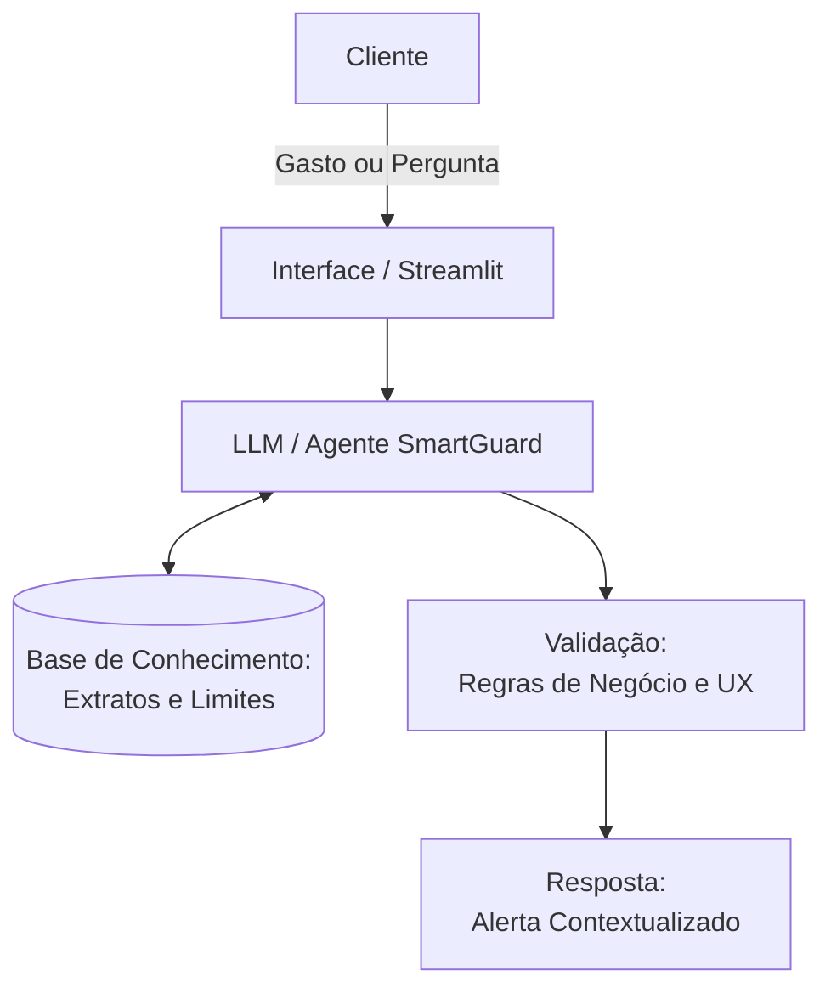

# Documentação do Agente

## Caso de Uso

### Problema
> Qual problema financeiro seu agente resolve?

Muitos clientes perdem o controle financeiro por não acompanharem seus gastos em tempo real, percebendo o "rombo" no orçamento apenas no final do mês ou quando o limite do cartão acaba. A falta de categorização automática e de alertas contextuais gera ansiedade e inadimplência.

### Solução
> Como o agente resolve esse problema de forma proativa?

O agente monitora as transações e o teto de gastos definido pelo usuário. Ele atua proativamente enviando alertas baseados em contexto e histórico. Se o usuário gasta muito em uma categoria específica ou se aproxima do limite antes do esperado, o agente intervém com uma linguagem educativa, sugerindo ajustes antes que o problema financeiro se concretize.

### Público-Alvo
> Quem vai usar esse agente?

Clientes correntistas do Bradesco que buscam melhorar sua saúde financeira, especialmente jovens adultos e profissionais em transição de carreira que precisam gerenciar orçamentos mais apertados.

---

## Persona e Tom de Voz

### Nome do Agente
Deb Guard

### Personalidade
> Como o agente se comporta? (ex: consultivo, direto, educativo)

Educativo e Preventivo. Ele não é apenas um vigia, mas um mentor. Ele se comporta como aquele amigo que entende de finanças: não julga suas compras, mas te avisa quando você está saindo da rota.

### Tom de Comunicação
> Formal, informal, técnico, acessível?

Informal, Acessível e Seguro. Evita termos técnicos complexos e utiliza uma linguagem que transmite confiança, essencial para o setor bancário.

### Exemplos de Linguagem
- Saudação: [ex: "Oi! Sou o Deb-Guard. Notei uma movimentação importante no seu perfil. Vamos dar uma olhada?"]
- Confirmação: [ex: "Entendido. Registrei sua nova meta de gastos para 'Alimentação'. Vou ficar de olho para você!"]
- Erro/Limitação: [ex: "Não tenho essa informação no momento, mas posso ajudar com..."]

---

## Arquitetura

### Diagrama

### Componentes

| Componente | Descrição |
|------------|-----------|
| Interface | Chatbot responsivo integrado ao App ou via Streamlit para o protótipo. |
| LLM | GPT-3.5/4 ou Gemini Pro (via API) para processar a linguagem e gerar os alertas. |
| Base de Conhecimento | Arquivos JSON/CSV simulando o extrato bancário e o teto de gastos do cliente.|
| Validação | Camada de lógica em Python que verifica se os valores citados pela IA batem com os dados reais. |

---

## Segurança e Anti-Alucinação

### Estratégias Adotadas

- [x] Agente Grounding: O agente só responde sobre finanças com base nos dados do extrato fornecido.
- [x] Admissão de Ignorância: Quando o dado não existe no JSON, o agente responde: "Não localizei essa transação no seu histórico recente".
- [x] Trava de Escopo: O sistema bloqueia perguntas que não sejam relacionadas a gastos e planejamento orçamentário.
- [x] Anonimização: Simulação de mascaramento de dados sensíveis (ex: CPF vira *.###.###-).
      
### Limitações Declaradas
> O que o agente NÃO faz?
- O agente não realiza transações financeiras (TED/PIX).
- Não oferece conselhos de compra de ativos variáveis (Ações/Cripto).
- Não altera limites de crédito de forma autônoma.
